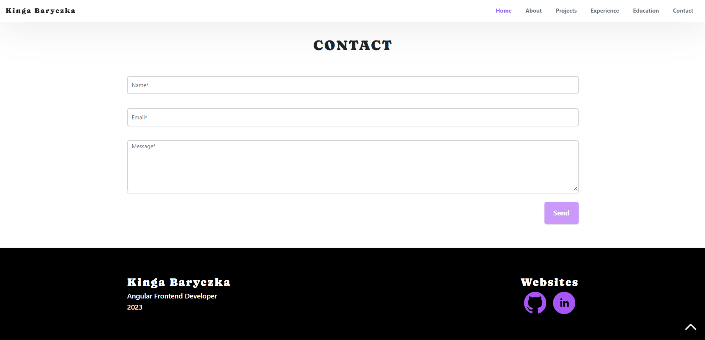

# PortfolioApp

This project was generated with [Angular CLI](https://github.com/angular/angular-cli) version 16.1.3.

## About

Tech stack: Angular 16, PrimeNG, TypeScript, HTML, SCSS

App consists of header, footer and six sections: Home, About, Projects, Experience, Education and Contact. Main aim of the app is to show my overall experience, skills and present short description of my projects. App allows to send me an e-mail by contact form. E-mail sending functionality is implemented using EmailJS.

## Home

## About

## Projects

## Experience

## Education

## Contact

